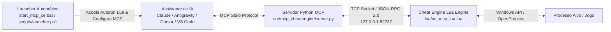

# 🎮 Cheat Engine MCP Server (Model Context Protocol)

[](https://www.python.org/)
[](https://docs.microsoft.com/powershell/)
[](https://www.cheatengine.org/)
[](https://modelcontextprotocol.io/)
[](docs/ARCHITECTURE.md)
[](LICENSE)

O **Cheat Engine MCP Server** é uma ponte de integração bidirecional via protocolo **Model Context Protocol (MCP)** entre assistentes de Inteligência Artificial (como Claude Desktop, Antigravity CLI/IDE, Cursor, VS Code Copilot) e o **Cheat Engine**.

Ele conta com um **sistema de inicialização automática em PowerShell e Batch** que localiza o Cheat Engine no Windows, acopla a ponte Lua no autorun e injeta as configurações do cliente de IA escolhido.

---

## 📐 Arquitetura do Projeto



Para mais detalhes sobre o modelo de execução assíncrona non-blocking e protocolo de comunicação, veja a [Documentação de Arquitetura](docs/ARCHITECTURE.md).

---

## ⚡ Funcionalidades Principais (21 Ferramentas MCP)

- **Inicialização & Pré-configuração Automática**: Script PowerShell (`scripts/launcher.ps1`) e Batch (`start_mcp_ce.bat`) para localização automática do Cheat Engine no registro do Windows, acoplamento da ponte Lua no autorun e injeção do JSON do cliente de IA.
- **Gerenciamento de Processos**: Listagem e anexo automático a processos por Nome ou PID, além de pausa e retomada de execução.
- **Manipulação de Memória**: Leitura, escrita, alocação segura (`allocateMemory` com limite de 10MB) e desalocação de regiões de memória.
- **Speedhack & Controle**: Ajuste fino do multiplicador de velocidade de processos (0.0x a 500.0x).
- **Address List / Cheat Table**: Leitura, adição de entradas e congelamento (`Active = true/false`) de registros na tabela do Cheat Engine.
- **Dumps de Memória Seguros**: Exportação e restauração de snapshots de memória com **Path Sandboxing estrito** (pasta `dumps\` isolada e extensões `.dmp`/`.bin`).
- **Resolução de Ponteiros**: Navegação automática em cadeias de ponteiros multinível com offsets.
- **Array of Bytes (AOB Scan)**: Busca por assinaturas de bytes em memória com wildcards (`48 8B 05 ?? ?? ?? ??`).
- **Resolução de Símbolos & Módulos**: Mapeamento de DLLs, executáveis e expressões relativas (`module.dll+0x1234`).
- **Desensamblador x86/x64**: Conversão de código de máquina para assembly em tempo real.
- **Auto Assemble Scripting**: Execução de scripts Auto Assemble para hooks e code caves.
- **Execução Arbitrária de Lua**: Automação avançada enviando scripts Lua diretamente para o interpretador do Cheat Engine.
- **Breakpoints de Hardware**: Configuração de breakpoints para inspeção de execução/leitura/escrita.

---

## 📁 Estrutura do Repositório

```
mcp-cheatengine/
├── .gitignore                      # Configuração completa do GitIgnore (Python, Lua, PowerShell, BAT)
├── LICENSE                         # Licença GNU General Public License v3.0
├── README.md                       # Documentação principal
├── requirements.txt                # Dependências Python (mcp)
├── pyproject.toml                  # Configuração de empacotamento Python
├── start_mcp_ce.bat                # Script de execução rápida para Windows (Batch com elevação UAC)
├── ce_mcp_server.py                # Wrapper de compatibilidade raiz (Python)
├── ce_mcp_lua.lua                  # Wrapper de compatibilidade Lua raiz
├── config/
│   ├── mcp_config.json             # Exemplo de configuração generica MCP
│   └── claude_desktop_config.json # Exemplo para Claude Desktop
├── docs/                           # Central de Documentação Completa
│   ├── ARCHITECTURE.md             # Especificação técnica e fluxo do sistema
│   ├── QUICKSTART.md               # Guia passo a passo de instalação
│   ├── API_REFERENCE.md            # Referência detalhada das 21 ferramentas MCP
│   ├── EXAMPLES.md                 # Exemplos reais de prompts e casos de uso
│   └── TROUBLESHOOTING.md          # Guia de solução de problemas e erros
├── lua/
│   ├── ce_mcp_lua.lua              # Servidor TCP Lua (para rodar no Cheat Engine)
│   └── autorun/
│       └── ce_mcp_autorun.lua      # Script de carregamento automático (Autorun)
├── scripts/
│   └── launcher.ps1                # Script PowerShell de busca no registro, acoplamento e injeção MCP
└── src/
    └── mcp_cheatengine/            # Pacote Python modularizado
        ├── __init__.py
        ├── __main__.py             # Entrypoint da aplicação
        ├── config.py               # Variáveis de ambiente e portas
        ├── rpc_client.py           # Cliente JSON-RPC via TCP Socket
        ├── server.py               # Servidor FastMCP
        └── tools/                  # Ferramentas categorizadas por domínio
            ├── __init__.py
            ├── process.py          # Gerenciamento de processos
            ├── memory.py           # Leitura e escrita de memória
            ├── scanner.py          # AOB Scan, símbolos e módulos
            ├── assembly.py         # Desensamblagem e Auto Assemble
            ├── lua.py              # Execução de código Lua
            ├── debugger.py         # Breakpoints de hardware/software
            ├── control.py          # Pausa, alocação, speedhack e dumps
            └── table.py            # Gerenciamento da Address List
```

---

## 🚀 Guia Rápido de Instalação e Uso

### Método 1: Automático (1-Clique via Batch / PowerShell)
Dê um duplo clique no arquivo [`start_mcp_ce.bat`](start_mcp_ce.bat) na raiz do projeto (ou execute no terminal `.\start_mcp_ce.bat`).

O script irá automaticamente:
1. Localizar o Cheat Engine instalado no seu sistema via Registro do Windows.
2. Copiar a ponte Lua para a pasta `autorun` do Cheat Engine.
3. Injetar a pré-configuração MCP nos assistentes de IA (Claude Desktop, Antigravity, Cursor, VS Code).
4. Inicializar o Cheat Engine com o MCP ativo na porta `127.0.0.1:52737`.

### Método 2: Manual
Consulte o [Guia de Quickstart](docs/QUICKSTART.md) para executar passo a passo via terminal.

---

## 🛠️ Resumo das Ferramentas MCP Expostas

| Ferramenta | Categoria | Descrição |
| :--- | :--- | :--- |
| `ce_ping` | Sistema | Testa a conectividade com o servidor Lua do Cheat Engine |
| `ce_list_processes` | Processos | Lista todos os processos em execução no Windows |
| `ce_attach_process` | Processos | Anexa o Cheat Engine a um processo alvo por PID ou Nome |
| `ce_get_attached_process` | Processos | Retorna o ID e nome do processo anexado |
| `ce_pause_process` | Controle | Pausa a execução de todas as threads do processo |
| `ce_unpause_process` | Controle | Retoma a execução do processo pausado |
| `ce_allocate_memory` | Controle | Aloca uma região de memória no processo alvo (máx: 10MB) |
| `ce_free_memory` | Controle | Libera uma região de memória previamente alocada |
| `ce_set_speedhack` | Controle | Altera o multiplicador de velocidade (0.0x a 500.0x) |
| `ce_read_memory` | Memória | Lê valores de memória em vários formatos de dados |
| `ce_write_memory` | Memória | Escreve valores numéricos, textos ou bytes na memória |
| `ce_read_pointer_chain` | Memória | Navega e resolve estruturas de ponteiros com offsets |
| `ce_aob_scan` | Varredura | Varredura por assinaturas de bytes em memória (AOB Scan) |
| `ce_get_address` | Varredura | Converte símbolos/expressões em endereços Hex |
| `ce_enum_modules` | Varredura | Lista todas as DLLs e executáveis do processo |
| `ce_disassemble` | Assembly | Desensambla instruções x86/x64 |
| `ce_auto_assemble` | Assembly | Executa scripts de injeção de código Auto Assemble |
| `ce_execute_lua` | Automação | Executa código Lua customizado no Cheat Engine |
| `ce_set_breakpoint` | Depuração | Configura breakpoints de hardware/software |
| `ce_get_address_list` | Tabela | Retorna os itens cadastrados na Address List |
| `ce_add_address_list_entry` | Tabela | Adiciona um novo endereço de memória à Address List |
| `ce_toggle_freeze` | Tabela | Congela/descongela a atualização contínua de um valor |
| `ce_dump_memory_to_file` | Snapshots | Exporta memória para a pasta isolada `dumps\` |
| `ce_load_memory_from_file` | Snapshots | Carrega dados de dump da pasta `dumps\` para a memória |

Consulte a [Referência Completa da API](docs/API_REFERENCE.md) para tipos de parâmetros e retornos.

---

## 🔒 Auditoria de Segurança

Todas as 21 ferramentas e scripts de automação passaram por auditoria estrita de segurança via agente subespecializado (`security_validator`):
- **Transporte Restrito**: Socket TCP escuta **exclusivamente em 127.0.0.1 (Loopback)**.
- **Sandboxing de Arquivos**: Leitura/escrita de dumps restringida à pasta `dumps\`, com bloqueio de Path Traversal (`..`) e sanitização de extensões (`.dmp`, `.bin`).
- **Proteção contra DoS**: Limites rígidos de alocação de memória (10MB) e dumps (50MB).

---

## 📄 Licença

Este projeto está licenciado sob a licença [GNU General Public License v3.0](LICENSE) (GPLv3).
